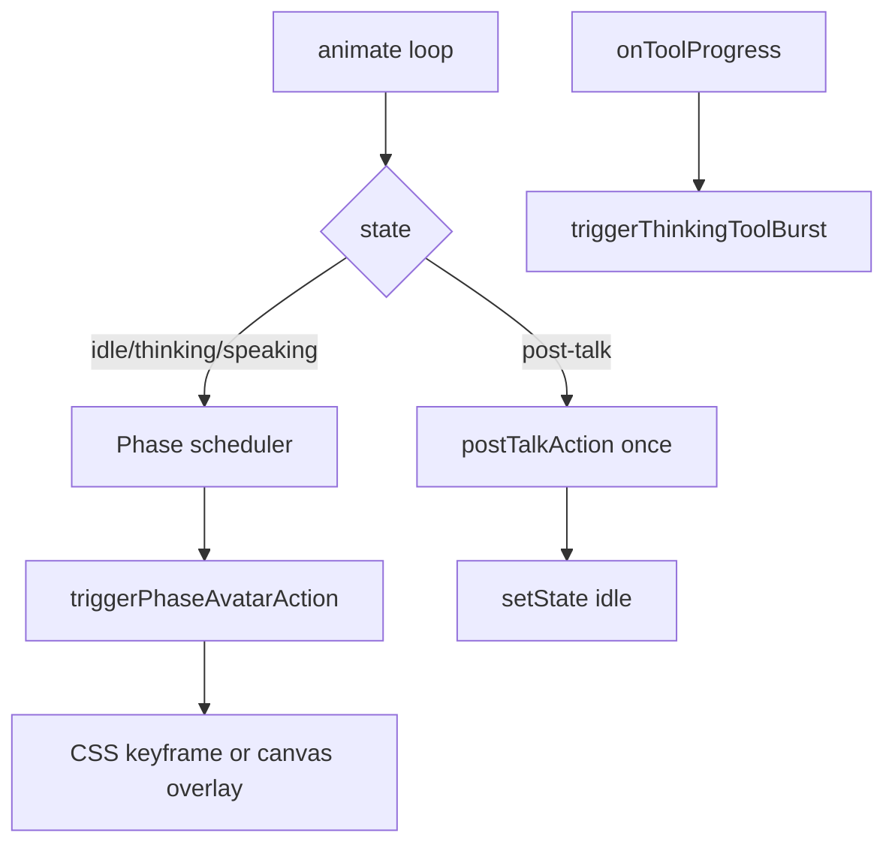

# Avatar Animation Map

Reference for animation behavior across all selectable avatar forms in the Aether HUD.

**Selectable forms:** `classic-blob`, `nova`, `wisp`, `eve`  
**States:** `idle`, `listening`, `thinking`, `speaking`, `post-talk`  
**Source files:** [`visualizer.js`](../visualizer.js), [`styles.css`](../styles.css), [`app.js`](../app.js)

---

## Architecture

Every avatar uses four animation layers:

| Layer | Trigger | Purpose |
|-------|---------|---------|
| **Ambient** | Always on while visible | Baseline life: bob, morph, pulse, sparkle |
| **Micro-action** | Scheduled during `idle`, `thinking`, or `speaking` | Personality beats on a timer |
| **State override** | Base motion per state | Listening lean, thinking hum, speech bob |
| **Post-talk** | One-shot after TTS ends | Wind-down before returning to idle |



### Scheduler pipeline

1. **`avatarBehaviorProfiles`** — per-form `idleActions`, `thinkingActions`, `speakingActions`, `postTalkAction`, interval ranges
2. **`updateAvatarBehavior()`** — runs every frame for all forms (blob + creatures)
3. **`triggerPhaseAvatarAction()`** — picks weighted action for current state; syncs `data-action` same frame
4. **`getActionDuration()`** — duration lookup for all action IDs
5. **`syncCreatureAvatarShell()`** — writes `data-state`, `data-action`, CSS vars on `#avatarLayer`

**Intensity curve:** `actionIntensity = sin(progress × π)` over action duration.

**Post-talk flow:** TTS `onEnd` → `markSpeechPlaybackStarted()` during speak → `enterPostTalk()` → plays `postTalkAction` → auto `setState('idle')`.

**Hermes thinking:** Continuous `thinkingActions` while waiting; `triggerThinkingToolBurst(toolName)` on tool progress for extra burst. Ambient thinking pulse (`--avatar-scan`, `--avatar-spark`, `--creature-state-boost`) runs independently of scheduler.

---

## Profile structure

```javascript
{
  idleActionRange: [3500, 7500],
  thinkingActionRange: [800, 1800],
  speakingActionRange: [500, 1200],
  postTalkAction: 'exhale-settle',
  postTalkDuration: 2600,
  idleActions: [['glance', 1.8], ...],
  thinkingActions: [['ear-flick', 1.7], ...],
  speakingActions: [['nod-beat', 1.5], ...],
}
```

Legacy alias: `actions` → `idleActions`.

---

## State flow (Hermes chat)

```
submitDirectTextCommand
  → setState('thinking')     // continuous thinkingActions + ambient pulse
  → onToolProgress           // triggerThinkingToolBurst
  → setState('speaking')     // if TTS on; speakingActions + mouth sync
  → markSpeechPlaybackStarted()
  → TTS onEnd                // enterPostTalk()
  → postTalkAction           // wind-down
  → setState('idle')

TTS off: typewriter finish → setState('idle') if still thinking
```

---

## classic-blob (Aether)

**Render:** Canvas + neural web. `#avatarLayer` empty.

| Phase | Actions |
|-------|---------|
| Idle | `soft-pulse`, `lobe-drift`, `web-flicker`, `core-shimmer`, `ring-tick`, `settle-sigh`, `orbit-wobble`, `node-cluster`, `halo-breathe` |
| Thinking | `web-surge`, `scan-sweep`, `lobe-compute` + periodic layer sweeps every ~2s |
| Speaking | `rim-flare`, `micro-pulse` |
| Post-talk | `settle-sigh` (3600ms canvas relax overlay) |

**Canvas overlays:** `applyBlobActionOverlay()` — modulates lobes, web, scale, shimmer, ring pulse, laser sweep boost.

---

## Nova

| Phase | Actions | CSS targets |
|-------|---------|-------------|
| Idle | + `tail-swish`, `stretch-yawn`, `look-around` | limbs, float, ears |
| Thinking | `ear-flick`, `weight-shift`, `paw-tap` + ambient `novaThinkingHum` on ears/core | ears, float, limbs |
| Speaking | `nod-beat`, `ear-twitch` | ears (body stays on `avatarSpeechBob`) |
| Post-talk | `exhale-settle` (2600ms) | float settle, cheek fade |

Existing idle: `glance`, `ear-perk`, `bounce`, `cheek-pulse`, `arm-wiggle`, `double-blink`.

---

## Wisp

| Phase | Actions | Notes |
|-------|---------|-------|
| Idle | + `float-drift`, `spark-trail`, `hem-flutter`, `slow-swirl` | |
| Thinking | `swirl-think`, `dim-gather`, `spark-orbit` | `swirl-think` only — no state-level drift duplicate |
| Speaking | `spark-accent` | spark peaks with speech energy |
| Post-talk | `spark-fade` (2500ms) | sparks dim, body sinks |

---

## EVE

| Phase | Actions | Notes |
|-------|---------|-------|
| Idle | + `shoulder-roll`, `visor-blink`, `ring-spin`, `gyro-wobble`, `pedestal-hum`, `stabilizer-kick`, `visor-flare`, `sync-tick` | |
| Thinking | `calibrate`, `scan-pulse`, `arm-fold`, `gyro-spin`, `data-stream` + ambient `eveThinkingHum` | no infinite head-tilt/scan on state alone |
| Speaking | `bar-flash`, `ring-echo` | mouth **core** only (`.eve-mouth-bar` hidden) |
| Post-talk | `power-down` (2800ms) | head lowers, visor dims, ring fades |

**Expression:** `[data-expression="thinking"]` styles eye glow.

---

## Hermes tool burst mapping

`triggerThinkingToolBurst(toolName)` maps tool names to burst actions:

| Tool hint | Blob | Creature default |
|-----------|------|------------------|
| search/find/grep/web | `web-surge` | `visor-scan` |
| shell/exec/run | layer sweep | `ring-calibrate` |
| read/file/write | `web-surge` | profile-specific |
| default | `web-surge` + sweep | `scan-pulse` / `ear-flick` / `spark-orbit` |

---

## Key symbols

| Symbol | File | Role |
|--------|------|------|
| `updateAvatarBehavior` | visualizer.js | Multi-phase scheduler |
| `triggerPhaseAvatarAction` | visualizer.js | Pick + start action |
| `triggerThinkingToolBurst` | visualizer.js | Hermes tool visual burst |
| `enterPostTalk` | visualizer.js | Idempotent TTS wind-down entry |
| `markSpeechPlaybackStarted` | visualizer.js | Flags active TTS for post-talk |
| `startPostTalkAction` | visualizer.js | Enter wind-down |
| `applyBlobActionOverlay` | visualizer.js | Canvas micro-action overlays |
| `getActionDuration` | visualizer.js | All action durations |
| `streamResponseText` | app.js | TTS → enterPostTalk wiring |
| `onToolProgress` | app.js | Hermes → tool burst |

---

## Test checklist

- [ ] Idle: new micro-actions fire every ~3.5–7.5s per avatar
- [ ] Thinking: ambient pulse + fast bursts (0.8–1.8s); burst on tool progress
- [ ] Speaking: mouth sync intact; subtle limb/spark/ring gestures
- [ ] Post-talk: visible wind-down after TTS ends; returns to idle ~2.5–3.6s
- [ ] TTS off: thinking → idle after typewriter completes
- [ ] Replay: same enterPostTalk path as live speak
- [ ] EVE: only `.eve-mouth-core` visible; bars hidden
